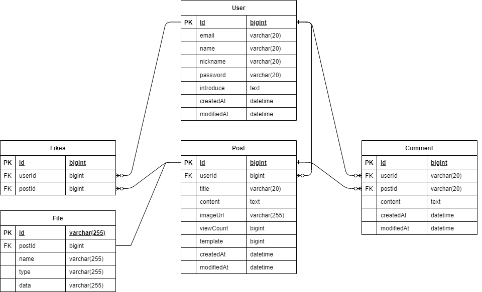

# pracBlog2
회원가입, 로그인, 이미지 업로드 및 게시글 작성, 댓글, 좋아요 기능을 갖는 블로그 백앤드 구현
## 상세 구현

### 1. 회원가입
   - 이름, 닉네임, 비밀번호 제한사항 설정 - 정규식 사용
   - 회원 아이디(이메일) 사용 가능 여부 확인
### 2. 로그인(Spring Security + JWT)
   - 회원 아이디(이메일) 및 비밀번호 일치여부 확인
   - 올바른 회원일 시 JwtTokenProvider 를 통해 토큰을 생성해서 클라이언트에게 내려줌
### 3. 게시글작성 
   - 로그인 시 받은 트콘을 헤더에 넣어서 요청을 보냄 ( 3번 부터는 Http 헤더에 모두 JWT 토큰을 넣어서 요청을 보냄 )
   - JwtAuthenticationFilter 에서 요청을 가로챈 후 토큰 유효성 검사 및 유저 정보를 Security Context 에 저장
   - @RequestPart
     - (value = "key") : PostRequestDto 객체로 제목, 내용 받음
     - (value = "file") : Multipart 객체로 이미지를 받음
   - @OneToOne 연관관계로 게시글과 이미지 각각 다른 테이블에 저장
### 4. 게시글 조회
   - API 두개 설정
     - ```ResponseEntity<PostRequestDto> getPost(@PathVariable Long id)``` : 게시글을 조회 요청
     - ```ResponseEntity<byte[]> getImage(@PathVariable Long id)``` : 게시글 조회 요청 시 responseDto 안에 넣어줄 이미지 URL
### 5. 게시글 수정
   - 이미지 O -> 이미지 X : 기존 이미지 DB 에서 삭제
   - 이미지 O -> 이미지 O : 기존 이미지 업데이트
   - 이미지 X -> 이미지 X : 유지
   - 이미지 X -> 이미지 O : 새로운 이미지 DB 에 저장
### 6. 게시글 삭제
   - 게시글 번호를 받고, UserDetails 의 유저 정보로 해당 게시글 작성자인지 확인
   - 연관관계에 있는 이미지, 댓글, 좋아요 함께 삭제 ( JPA 연관관계와 영속성 컨텍스트에 대한 이해 필요 )
### 7. 댓글 작성
   - @PathVariable 로 들어오는 id 값으로 Post post 객체를 찾아온다
   - Comment 생성자에 인자로 post 를 넣어줘 연관관계 형성 후 save 로 DB 에 저장
### 8. 댓글 수정
   - 댓글의 작성자인지 확인
   - 확인 후 댓글 내용 업데이트 
### 9. 댓글 삭제
   - 댓글 작성자인지 확인
   - deleteById 로 삭제
### 10. 좋아요 및 취소
   - 겪었던 오류 : 테이블 명을 Like 로 했더니 테이블이 ```jpa.hibernate.ddl-auto: create``` 로 생성이 되지 않아 Likes 로 변경 ( H2 사용했을때 )
   - findByPostAndUser(Post post, User user) 를 통해 이미 좋아요를 누른 게시글인지 확인
   - 누르지 않았다면 DB 에 저장
   - 취소는 반대로 진행
### 11. 유효성 체크 및 에러코드
1. 유효성 체크
   - Controller 에서 @RequestBody, @RequestPart 로 들어오는 값들에 대해 @Valid 를 이용해 유효성 검사 진행
   - Dto 클래스에 @Size, @NotNull, @Pattern 등 사용
2. 에러코드
   - GlobalExceptionHandler 의 @ExceptionHandler 을 이용해 코드 전체에서 나오는 특정 오류들을 모아서 처리
   - @ExceptionHandler 선언한 메서드의 반환을 ResponseEntity<ErrorResponse> 로 진행. 
     - ErrorResponse 클래스 생성
   - ErrorResponse 객체 생성 시 ErrorCode 객체를 인자로 받음. 
     - ErrorCode enum 생성
   - ErrorCode enum 에 사용할 에러 코드를 생성해서 필요한 위치에 사용
   - 직접 Exception 을 생성해서 사용 : ```public class BusinessException extends RuntimeException {}``` 
     - 생성 시 ErrorCode 를 인자로 받음
### 12. CORS
   - S3 을 이용하는 경우 설정하는 듯? 아직 정확하게 모르겠음..
### 13. N+1 문제와 FetchType.Lazy / Eager
1. 발생 원인
   1. 즉시 로딩: JPQL 을 사용하여 조회 시 하나의 객체를 조회하면 연관된 정보들을 하나씩 조회하며 발생
   2. 지연 로딩: 테이블 전체를 조회 시 객체를 이용해 getObject() 를 사용하면 모든 객체를 하나씩 조회하며 발생
2. 해결방법
   1. 페치 조인
   2. 하이버네이트 @BatchSize
   3. 하이버네이트 @Fetch(FetchMode.SUBSELECT)
3. 지연로딩을 사용하자!
### 14. 테스트 코드 작성
1. Service 테스트 코드
2. Controller 테스트 코드

### 15. 트러블슈팅
1. 흠...기억해보자...
### 16. 추가 진행해야 할 것
   - 이미지 저장을 AWS S3 로 해보기
   - JPA 연관관계 속성 fetch, cascade, orphanRemoval 이해하고 사용하기
   - 빌더 패턴 적용
## Reference
[Spring Security](https://webfirewood.tistory.com/115)  
[Spring Security2](https://www.tutorialspoint.com/spring_security/spring_security_quick_guide.htm)  
[Spring Security3](https://www.toptal.com/spring/spring-security-tutorial)  
[Image Upload](https://www.bezkoder.com/spring-boot-upload-file-database/)  
[Image Upload2](https://medium.com/jaehoon-techblog/simpleblog-%EA%B0%9C%EB%B0%9C-%EC%9D%BC%EC%A7%80-4-55a8d2a8604)  
[Image Upload3](https://eastflag.co.kr/fullstack/rest-with-spring/spring-rest_image/)  
[Exception](https://cheese10yun.github.io/spring-guide-exception/)  
[Validation](https://gardeny.tistory.com/36)  
[Validation2](https://bamdule.tistory.com/35)  
[ControllerTestCode](https://www.tutorialspoint.com/spring_boot/spring_boot_rest_controller_unit_test.htm)  
